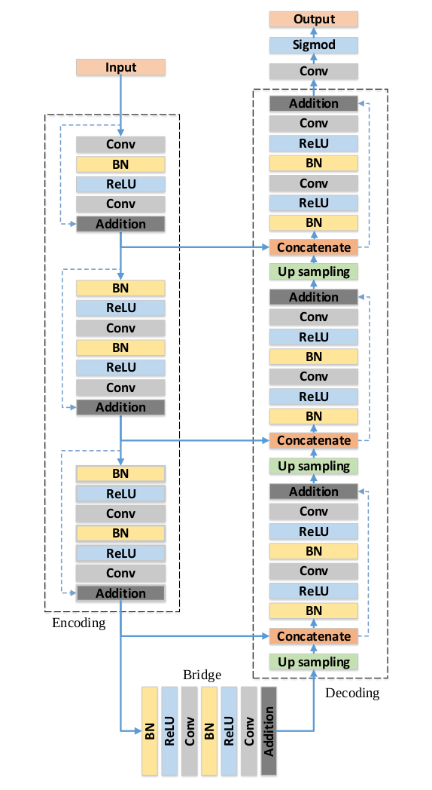

# Deep Residual U-Net
This is a tensorflow implementation of [Deep residual U-Net](https://arxiv.org/abs/1711.10684) for image segmentation.

## Deep Residual U-Net
U-Net is a convolutional neural network architecture typically used for semantic segmentation applications. [The original
U-Net](https://arxiv.org/abs/1505.04597) combines low level features with high level features by concatating activation 
maps from an encoder (contracting path) with a decoder (expanding path). This allows information learned at the low level 
to propagate to the higher semantic level. Each layer in the U-Net consists of 2 consecutive Convolution-Batch Normalization-Relu 
blocks (though original U-Net did not include batch normalization).


In general a U-Net architecture can be considered any convolutional neural 
network with a contracting and expanding path where feature maps are concatenated between these paths. 
The Deep Residual U-Net applies this architecture with 2 notable differences. 
1. Instead of using "valid" convolutions which result in downsampling of the feature map "same" convolutions are used, preserving the feature map size.  
2. A residual connection is introduced for each layer. This adds the input to each layer to the output of the same layer.



## Implementation
The model architecture is built as closely as possible to the original paper. However, the upsampling function used in the paper is 
not clearly specified so for this implementation we use bilinear interpolation. The learning rate is decayed using a cosine decay without warmup or restarts. 
The current implementation has 3 data augmentation operations, namely - rotations, mirroring and additive gaussian noise.
At the end of each training epoch the training and validation losses are reported along with the accuracy (intersection over union). The model is 
trained with pixel weighted cross-entropy. If no weights are provided uniform weights are applied. When running the model in prediction mode 
segmented labelmaps will be written to file.

## Data Format
Both training and validation/test data should be provided in the form of a comma separated text file which contains the paths to the images and labels. 
Each row must be a seperate sample. Images should .jpg while labels should .png. See example below

```
/home/path/to/image1.jpg, /home/path/to/label1.png
/home/path/to/image2.jpg, /home/path/to/label2.png
```

It is also possible to supply a weight map as in the original U-Net. The weight map is an image with a weight for each pixel.
Regions or pixels with greater importance (or undersampled) should have a higher weight. These images are added as an additional comma
separated path.

```
/home/path/to/image1.jpg, /home/path/to/label1.png, /home/path/to/weight1.png
```

## Usage
The model and hyperparameters can be set from the command line. For example to train a model for 50 epochs 
with a batch size of 8 and 4 encoder layers. 

```
python main.py --train_file='/home/path/to/train.txt' --val_file='/home/path/to/val.txt' --batch_size=16 --num_classes=4 --num_layers=4
```

The default number of filters in the first layer of the encoder is 64. Each encoder layer double the number of filters from the preceding layer. To 
increase the number of filters just set the number of filters in the first layer with the *filters* argument. For example

```
python main.py --train_file='/home/path/to/train.txt' --val_file='/home/path/to/val.txt' --batch_size=16 --num_classes=4 --num_layers=4 --filters=16
```

Data augmentation is controlled by the arguments *mirror*, *rotate* and *noise*. By default these are all true. They can be turned on or off as folllows

```
python main.py --train_file='/home/path/to/train.txt' --val_file='/home/path/to/val.txt' --batch_size=16 --num_classes=4 --num_layers=4 --filters=16 --mirror=False --rotate=True --noise=False
```

The argument *use_weights* should be set when a weight labelmap is being used. By default this is set to false.

```
python main.py --train_file='/home/path/to/train.txt' --val_file='/home/path/to/val.txt' --batch_size=16 --num_classes=4 --num_layers=4 --use_weights=True
```

To run the model in prediction mode set the *mode* argument to 'predict' and set the text file containing image paths with the *val_file* argument, *num_layers* and *filters* must be the same as that of the saved model. The saved weights are automatically assumed to be in the logs folder. Images are saved to a predictions folder inside the log folder.

```
python main.py --mode=predict --val_file='/home/path/to/val.txt' --batch_size=16 --num_classes=4 --num_layers=4 --filters=16
```
